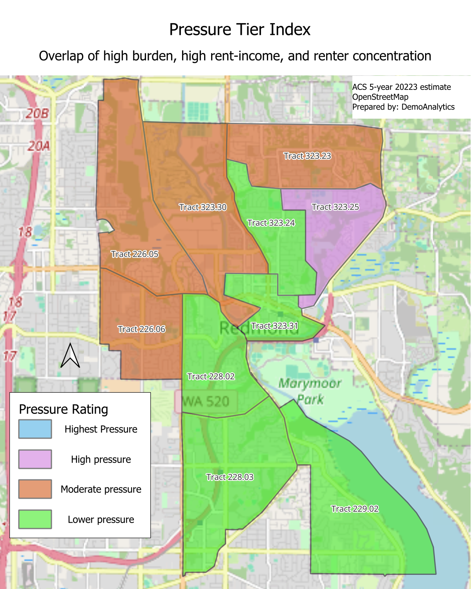
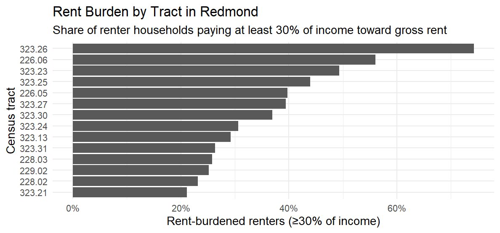

# Redmond Renter Affordability Snapshot (ACS 2023)

A short tract-level affordability snapshot for Redmond, WA using ACS 2023 5-year data.

## Key outputs
- Pressure Tier Index map
- Rent burden (≥30% of income) by tract chart

## Figures

## Data + methods (high level)
- Source: ACS 2023 5-year (tables B25070, B25064, B19013, B25003)
- Tools: R (tidycensus, sf, tigris, tidyverse), QGIS
- Basemap: © OpenStreetMap contributors (ODbL)
